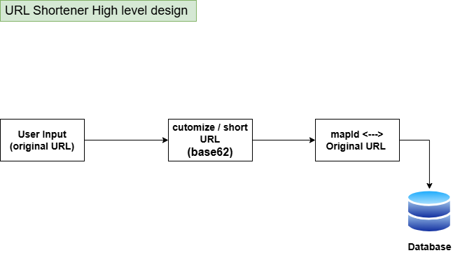

# URL Shortener 

A high-level system design for a URL Shortener application, similar to TinyURL or Bitly.  
This document explains how a long URL is converted into a short, customizable URL, stored, and redirected.

---

## 🔹 Overview

The URL Shortener system allows users to:

- Input a long URL
- Customize the short URL 
- Map the short URL to a unique ID internally
- Store the mapping in a database
- Redirect users from the short URL to the original URL

---

## 🔹 High-Level Flow

---

## 🔹 Redirect Flow

---

## 🔹 Components

- **User Input / Client:** Accepts long URLs and optional custom short URL
- **Backend Server / Controller:** Handles user requests and redirects
- **Service Layer:** Generates short IDs, handles custom URLs, and processes mappings
- **Database:** Stores the mapping of short ID → original URL
- **Optional Cache (Redis):** Speeds up redirects for frequently used URLs

---

## 🔹 Data Model

URLs Table
id (PK) | shortCode | longURL | createdAt

- `shortCode`: Unique identifier for the short URL (auto-generated or customized)
- `longURL`: Original URL input by the user
- Indexed for fast lookup

---

## 🔹 Key Design Considerations

- **Short ID Generation:** Base62 encoding, hashing, or random string

  Base62 is used to convert numeric IDs into short, URL-friendly codes.

  Characters (62 total)
  0123456789abcdefghijklmnopqrstuvwxyzABCDEFGHIJKLMNOPQRSTUVWXYZ

  How it works

  When a URL is saved, database generates an auto-increment ID.

  Convert this ID → Base62 string (short code).

  Save the short code and return:

  https://domain/<shortCode>

  Encode (ID → Base62)
  while id > 0:
    remainder = id % 62
    code = charset[remainder] + code
    id = id // 62

  Decode (Base62 → ID)
  id = 0
  for each char in code:
    id = id * 62 + index_of(char)

  Why Base62?

  URL-safe

  Short output

  Human-readable

  No collisions (direct ID mapping)
- **Custom URLs:** Users can choose a custom alias if desired
- **Scalability:** Use caching and database sharding for millions of URLs
- **Reliability:** Database replication to avoid data loss
- **Optional Features:** Link expiration, analytics (clicks, location, device), rate limiting

---

## 🔹 System Benefits

- Compact, customizable, easy-to-share URLs  
- Fast redirection with low latency  
- Scalable for millions of URLs  
- Extensible for analytics, custom aliases, and link expiration
