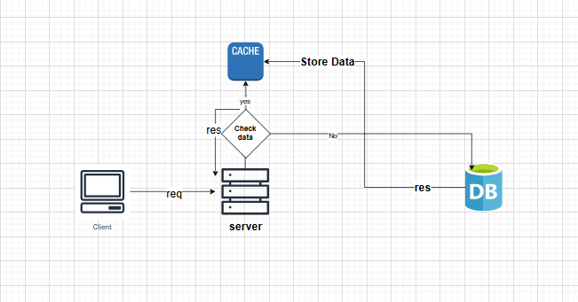

# ⚡ Caching Explained

## 🧠 What is Caching?
Caching is a technique to store frequently accessed data in a temporary storage location (memory or disk) so that future requests can be served faster.  
It reduces database load, improves performance, and enhances user experience.

---

## ⚙️ How Cache Works
1. Client sends a request for data.  
2. Server first checks whether the data exists in the cache.  
3. If found (**Cache Hit**) → return data instantly.  
4. If not found (**Cache Miss**) → fetch data from the database, store it in cache, then respond.  
5. Cached data expires after a defined **TTL (Time To Live)**.

---

## 🌍 Real-World Example
Imagine there are **1000 users** stored in the database.

### 🧾 Step-by-Step Flow:
1. **Client:** “Give me 10 users.”  
2. **Server:** Checks cache.  
   - ❌ Cache empty → fetches 10 users from **Database**.  
   - Stores them in **Cache** for 10 minutes (TTL).  
   - Sends response to client.  
3. After 5 minutes, the same or another client requests “Give me 10 users.”  
   - ✅ Cache Hit → data returned instantly (no DB hit).  
4. After 12 minutes, cache expired.  
   - ⏱ Server fetches data again from DB, updates cache, and returns response.

This approach reduces database calls, improves speed, and ensures efficient system performance.

---

## 🔐 Session Timeout and Client-Side Cache

### 💬 What Happens When Session Expires?
Client-side cache and server session are **separate** concepts:

- **Client-side cache** (LocalStorage, SessionStorage, IndexedDB, HTTP cache)  
  → Stores data in the user's browser or app.  
- **Server session timeout**  
  → Defines how long the server keeps the user logged in.

### 🧩 Behavior:
1. If the session expires, the client **cannot fetch new data** from the server (server rejects unauthorized requests).  
2. But any **already cached data** (like 10 users stored earlier) in **LocalStorage** or **IndexedDB** still exists in the browser.  
3. Only **SessionStorage** clears automatically when the browser tab closes.  

✅ So:  
- Cache itself is **not deleted** when session expires.  
- You just can’t request **new data** until re-authentication happens.  

---

## 🧩 Types of Caching
- **Client-Side Cache:** Stored in the user’s browser/app (LocalStorage, SessionStorage, HTTP cache).  
- **Server-Side (In-Memory) Cache:** Stored in server RAM (like Node.js MemoryCache, .NET MemoryCache).  
- **Distributed Cache:** External systems like **Redis** or **Memcached**, shared among multiple servers.  
- **Database Cache:** Databases like MySQL or PostgreSQL maintain their own query-level caches.

---

## 🔁 Cache Strategies
- **Cache-Aside:** App checks cache first → if miss → fetch from DB and store in cache.  
- **Write-Through:** Data is written to cache and DB simultaneously.  
- **Write-Back:** Data written to cache first, DB updated asynchronously later.

---

## ⏱️ Expiry and Eviction
- **TTL (Time To Live):** Cached data expires after a defined duration.  
- **Eviction Policies:**
  - 🧹 **LRU (Least Recently Used)** – removes least recently used data.  
  - 🔁 **LFU (Least Frequently Used)** – removes least accessed data.  
  - 📦 **FIFO (First In, First Out)** – removes oldest data first.

---

## 🚀 Benefits
- ⚡ Faster response time  
- 📉 Reduced database load  
- 📈 Better scalability  
- 🧑‍💻 Improved user experience  

---

## ⚠️ Limitations
- 🧠 Limited memory (cannot store all data)  
- ⏰ Stale or inconsistent data if cache not updated properly  
- 🧩 Extra complexity for invalidation logic  
- 💾 Data loss if in-memory cache restarts (unless persisted)

---

## 🖼️ Cache Architecture Diagram

