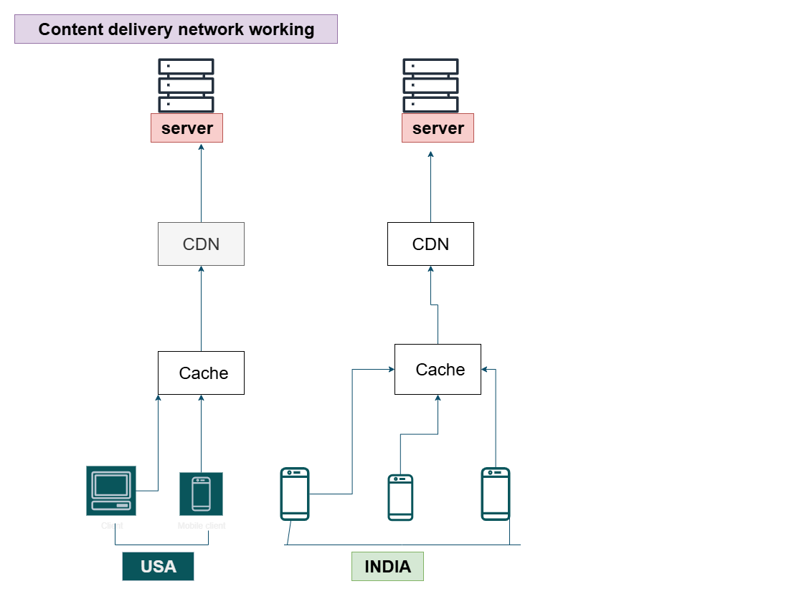

# Content Delivery Network (CDN) 🌍

## 🔹 What is a CDN?
A **Content Delivery Network (CDN)** is a system of **distributed servers** placed in different regions across the world.  
Its main goal is to **deliver website content faster** to users by storing cached copies of data **closer to their location**.

---

## 🔹 How It Works
When a user visits a website:
1. The CDN checks if the requested content (like images, videos, or HTML files) is available in a nearby server (edge server).  
2. If the content is found (cache hit), it is delivered **directly from the nearest CDN server** — very fast.  
3. If not (cache miss), the request goes to the **main/origin server**, and the response is **cached** for future requests in that region.

So, instead of every client fetching data from one central server, users get data from the **closest CDN node**, reducing delay and load.

---

## 🔹 Example
- A user from **India** visits your website.  
  The content is served from a **CDN node in Mumbai** instead of the main server in the USA.  
- Another user from **Germany** gets the same content from a **Frankfurt CDN node**.

This reduces **latency**, improves **page load time**, and **decreases bandwidth usage** on the main server.

---

## 🔹 Diagram

---

## 🔹 Benefits of CDN
✅ **Fast content delivery** – data served from the nearest region.  
✅ **Reduced server load** – main/origin server handles fewer requests.  
✅ **Improved reliability** – even if one node fails, others serve content.  
✅ **Global scalability** – handles users from any region efficiently.  

---

## 🔹 Summary
- CDN = Network of distributed servers that **cache content close to users**.  
- Reduces **latency** and **server load**.  
- Delivers content **faster, more reliably, and globally**.

---
