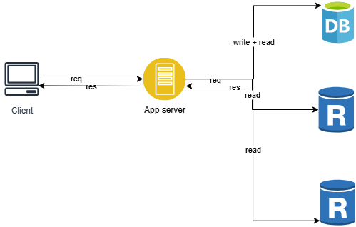

# Database Replica 🗄️

## 🔹 What is Database Replica?
A **Database Replica** is simply a **copy of the original (primary) database**.  
It is mainly used in system design to improve performance, reduce load on the main database, and provide faster responses to user requests.

---

## 🔹 How it Works
- All **write operations** (insert, update, delete) go to the **original database**.  
- Replicas are continuously updated with a copy of this data.  
- Applications can **read data** from replicas instead of always querying the main database.  
- If the original database is busy or not responding, replicas can still serve read requests.  

---

## 🔹 Why We Use Database Replicas
1. **Overcome load on the main database** → replicas share the read traffic.  
2. **Fast response to users** → replicas can be placed closer to users in different regions.  
3. **High availability** → if the main database goes down, replicas can still provide data.  
4. **Backup and recovery** → replicas act as live copies in case of failure.  

---

## 🔹 Example Diagram

---

## 🔹 Summary
- A **replica = copy of the original database**.  
- Helps when the original database is **busy or unavailable**.  
- Improves **system performance, scalability, and reliability**.  

---

