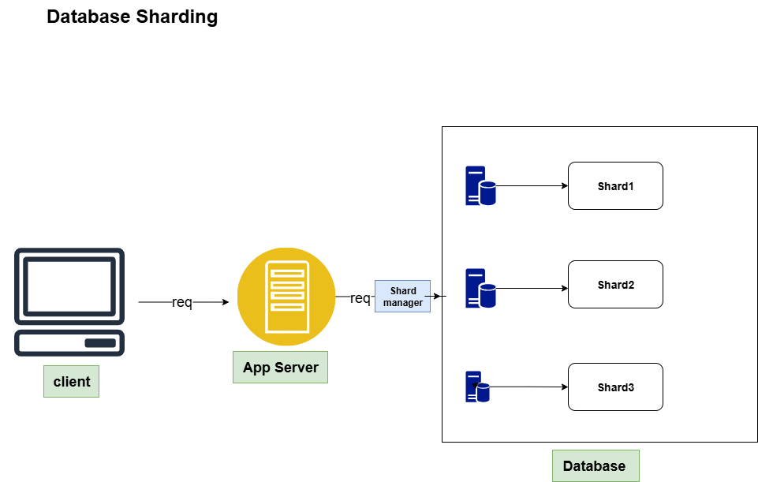

# Database Sharding 🧩

## 🔹 What is Database Sharding?
**Database Sharding** means dividing a large database into smaller, more manageable pieces called **shards**.  
Each shard holds a portion of the data — and together, all shards represent the complete dataset.

---

## 🔹 Example (College Database)
Imagine a **college database** containing student information for all departments.

Instead of keeping everything in one large database, we divide it based on **department**:

| Shard Key | Department | Stored Data |
|------------|-------------|-------------|
| CSE | Computer Science | All CSE students |
| EX | Electrical | All Electrical students |
| ME | Mechanical | All Mechanical students |
| CE | Civil | All Civil students |

Here, **department name** (CSE, EX, ME, CE) is the **shard key**, and each department’s data forms one **shard**.

---

## 🔹 How Sharding Works
- A **shard key** is chosen (e.g., department name or student ID).  
- The system decides which shard to store or fetch data from based on this key.  
- When a query comes in, the app server uses the shard key to reach the correct shard directly instead of searching the entire database.

---

## 🔹 Benefits of Sharding
1. **Improved performance** → each shard handles only part of the total load.  
2. **Horizontal scalability** → easy to add new shards (servers) as data grows.  
3. **Reduced query time** → smaller datasets per shard means faster lookups.  
4. **High availability** → one shard’s issue doesn’t affect others.  

---

## 🔹 Example Diagram

---

## 🔹 Summary
- Sharding = **Splitting one big database into smaller parts**.  
- Each shard stores **a specific portion** of data (based on shard key).  
- Helps achieve **speed, scalability, and reliability** in large systems.

---
