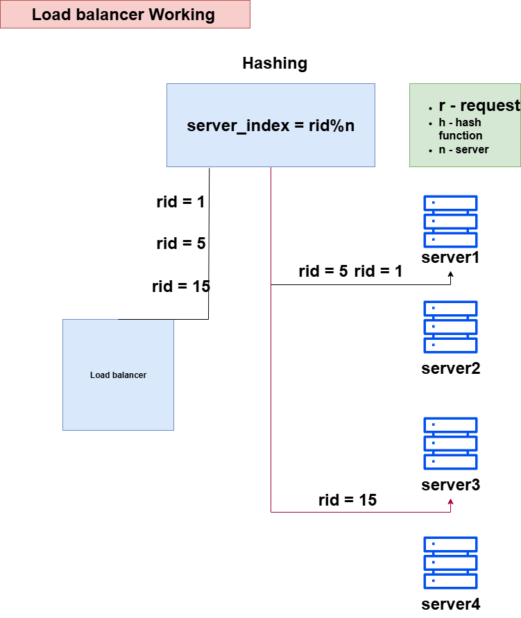

# Load Balancing ⚖️

## 🔹 What is a Load Balancer?
A **Load Balancer** is a system that distributes incoming client requests across multiple servers.  
It ensures no single server gets overloaded and helps maintain high availability, reliability, and better performance.

---

## 🔹 How it Works
In the given diagram, the load balancer uses **hash-based distribution**:

- Each request has an ID (`rid`).  
- The load balancer calculates the server index using the formula:  

server_index = rid % n

Where:  
- `rid` → request ID  
- `n` → number of servers  

### Example (from diagram):
- If `rid = 1` → `1 % 4 = 1` → goes to **Server 2**  
- If `rid = 5` → `5 % 4 = 1` → goes to **Server 2**  
- If `rid = 15` → `15 % 4 = 3` → goes to **Server 4**  

👉 This ensures requests are distributed across servers in a predictable way.

---

## 🔹 Benefits of Load Balancing
1. **High Availability** → If one server goes down, traffic is redirected to others.  
2. **Scalability** → Supports adding/removing servers without downtime.  
3. **Performance** → Distributes requests so no single server is overloaded.  
4. **Fault Tolerance** → Prevents failure of one server from impacting all users.  
5. **Efficient Resource Usage** → Ensures optimal use of all servers.  

---

## 🔹 Diagram
Below is the working diagram you provided (hash-based load balancing):

---

